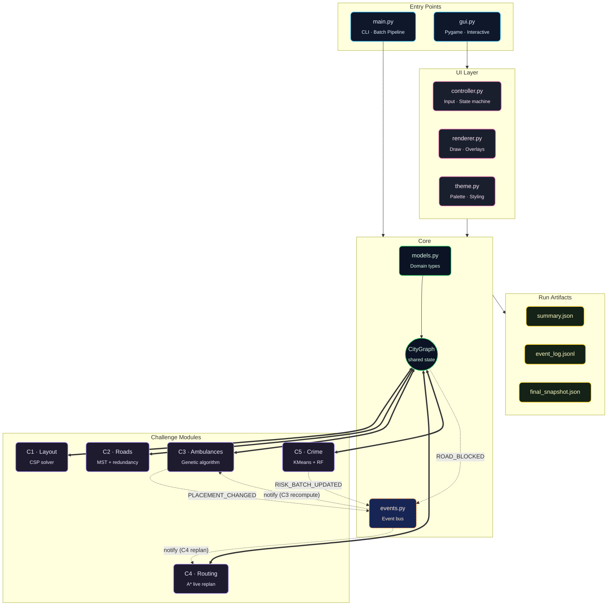

# CityMind

### Urban Intelligence Simulation Platform

*Design smarter cities through graph algorithms, optimization, and machine learning — all in one integrated, reproducible pipeline.*

  


Constraint Satisfaction · Graph Optimization · Genetic Algorithms · Heuristic Search · Machine Learning


---

## Overview

**CityMind** models a city as a living graph and tackles five tightly-coupled urban problems — from zoning to emergency response — inside a single coherent simulation. Every challenge reads from and writes to a shared `CityGraph`, and the pipeline reacts to events (road blocks, risk shifts, placement changes) the way a real city does.

> Plan the layout. Optimize the roads. Predict the risk. Position the ambulances. Route them under pressure. Then watch it all unfold — tick by tick.


|        | Capability                         | Technique                                  |
| ------ | ---------------------------------- | ------------------------------------------ |
| **C1** | City zoning under hard constraints | Backtracking + AC-3 + Min-Conflicts        |
| **C2** | Resilient road network design      | Hand-coded Kruskal MST + redundancy passes |
| **C3** | Strategic ambulance placement      | Hand-coded Genetic Algorithm               |
| **C4** | Dynamic emergency routing          | Hand-coded A with live replanning          |
| **C5** | Spatial crime risk prediction      | Hand-coded KMeans + Random Forest          |


---

## Highlights

- **Unified city model** — every module operates on a single `CityGraph`, the system's source of truth.
- **Policing on the graph** — Challenge 5 writes each node's officer count to `officer_allocation` on the shared graph (`set_officer_allocation_bulk`), so coverage is queryable like risk and roads—not only from UI/controller cache.
- **Event-driven** — `RISK_UPDATED`, `RISK_BATCH_UPDATED`, `ROAD_BLOCKED`, and `PLACEMENT_CHANGED` propagate through a lightweight bus, triggering replans and rebalancing automatically. C5 emits a single batched event per prediction pass so C3 reacts exactly once per refresh.
- **Hop-preserving roads** — after MST + redundancy, C2 runs a third pass that re-validates the C1 hop guarantees ("residential within 3 hops of a hospital", "power plant within 2 hops of industrial") on the *post-pruned* graph and adds the cheapest non-tree edges needed to repair any violation it finds.
- **Stepwise risk shifts** — when enabled, C5 re-runs every simulation tick so risk-sensitive edge weights and ambulance placements track the live state of the city instead of staying frozen at t=0.
- **Two simulation modes** — `strict20` stops at the configured step cap; `complete` keeps stepping until every civilian has been reached or proven unreachable (bounded by `completion_step_cap`).
- **Two ways to run** — headless `main.py` for batch experiments, or `gui.py` for a fully interactive Pygame visualization.
- **Reproducible by design** — deterministic seeding across all stages, with config-fingerprinted, timestamped JSON artifacts so distinct runs never overwrite each other.
- **Composable** — each challenge is self-contained, testable, and swappable without touching the rest of the system.

---

## Core Architecture




**Legend** — blue entry points · pink UI layer · green shared core · purple challenge solvers · orange dashed event bus · yellow persisted artifacts.

---

## End-to-End Pipeline

```mermaid
flowchart LR
    classDef step fill:#0b1324,stroke:#22c55e,color:#e5e7eb,stroke-width:1.2px,rx:6,ry:6;
    classDef sim  fill:#1f1b2e,stroke:#f59e0b,color:#fef3c7,stroke-width:1.2px,rx:6,ry:6;
    classDef out  fill:#142217,stroke:#facc15,color:#fef9c3,stroke-width:1.2px,rx:6,ry:6;

    A["1. Build grid"]:::step --> B["2. C1 · Layout"]:::step --> C["3. Reweight residential roads"]:::step
    C --> D["4. C2 · MST + redundancy"]:::step --> D2["5. C2 · C1 hop repair"]:::step
    D2 --> E["6. C5 · Initial risk"]:::step
    E --> F["7. C3 · Place ambulances"]:::step --> G["8. C4 · Initialize routing"]:::step
    G --> H["9. Tick loop<br/><sub>flood · C5 risk refresh · batched C3 recompute · C4 advance/replan</sub>"]:::sim
    H --> J{"10. Mode?"}:::sim
    J -- "strict20" --> K["Stop at step cap"]:::sim
    J -- "complete" --> L["Stop when civilians exhausted<br/><sub>(or completion cap)</sub>"]:::sim
    K --> I["11. Persist artifacts"]:::out
    L --> I
```




---

## Challenge Modules


|     |
| --- |
|     |


### C1 · Layout Constraint Solver

`challenges/c1_layout.py`

Assigns a zone type to every node while satisfying hard rules:

- Industrial **cannot** border School / Hospital
- Residential **must** be within 3 hops of a Hospital
- PowerPlant **must** be within 2 hops of an Industrial zone

Uses **backtracking + AC-3 + heuristics**, with a **min-conflicts** fallback for larger graphs.


### C2 · Road Network Optimization

`challenges/c2_roads.py`

Builds a low-cost backbone using a **manual Kruskal MST**, then adds the smallest set of extra edges needed to guarantee redundant hospital ↔ depot paths. A third pass re-validates the **C1 hop constraints** on the optimized graph and patches in the cheapest non-tree edges to repair any "residential ≤3 hops from a hospital" or "power plant ≤2 hops from industrial" violation that pruning broke.

### C3 · Ambulance Placement

`challenges/c3_ambulance.py`

A **hand-coded genetic algorithm** (tournament selection, single-point crossover, mutation, elitism, frozen-set fitness cache) searches for ambulance positions that minimize the **worst-case** response distance to any node — robust to where emergencies actually happen.


### C4 · Dynamic Emergency Routing

`challenges/c4_routing.py`

Plans and continuously refines ambulance routes with a **hand-coded A** (binary heap, consistent `0.8 × Manhattan` heuristic, multi-target sequencing by cheapest path). Listens for `ROAD_BLOCKED` events and **automatically replans** any active path that's affected.


### C5 · Crime Risk Prediction

`challenges/c5_crime.py`

Builds neighborhood-level features → clusters with a **hand-coded KMeans** (10 random restarts, inertia tracking) → predicts risk with a **hand-coded Random Forest** (bootstrap bagging + Gini decision trees with √n_features per split + majority vote) → updates per-node risk levels and re-allocates patrol officers by priority. Applies all updates atomically via `set_risks_bulk` and emits a single `RISK_BATCH_UPDATED` event per pass, so downstream stages (notably C3's GA) re-run exactly once per refresh instead of once per node. When `risk_refresh_every_step` is enabled, the predictor runs every simulation tick so the city's risk surface — and the placements/edge weights derived from it — actually shift over time.


---

## Quick Start

### 1. Install dependencies

```bash
pip install -r requirements.txt
```

### 2. Run the pipeline (headless)

```bash
python main.py
```

(runs with default seed 42, 20 steps and 25 nodes)

OR 

```bash
python main.py --seed 42 --steps 40 --nodes 25
```

### 3. Or launch the interactive GUI

```bash
python gui.py
```

---

## Usage

### CLI · `main.py`

```bash
python main.py [--seed N] [--steps N] [--rows R --cols C] [--nodes N] \
               [--mode {strict20,complete}] [--completion-cap N] [--no-risk-refresh]
```


| Flag                | Description                                                                                                  |
| ------------------- | ------------------------------------------------------------------------------------------------------------ |
| `--seed`            | Deterministic random seed for the entire run                                                                 |
| `--steps`           | Number of simulation ticks (the strict cap; also the floor for completion mode)                              |
| `--rows --cols`     | Explicit grid dimensions                                                                                     |
| `--nodes`           | Auto-pick a near-square grid of size N (used if `--rows/--cols` are omitted)                                 |
| `--mode`            | `strict20` stops at `--steps`; `complete` keeps stepping until civilians are exhausted (default: `strict20`) |
| `--completion-cap`  | Hard upper bound on steps for `complete` mode (default 500)                                                  |
| `--no-risk-refresh` | Disable per-step C5 re-prediction during the simulation loop                                                 |


### GUI Controls · `gui.py`


| Key             | Action                        |     | Key       | Action                                           |
| --------------- | ----------------------------- | --- | --------- | ------------------------------------------------ |
| `Space`         | Step once                     |     | `1` – `4` | Switch overlays                                  |
| `R`             | Toggle auto-run               |     | `C`       | Open customization panel                         |
| `A`             | Run until civilians exhausted |     | `M`       | Toggle simulation mode (`strict20` ↔ `complete`) |
| `+` / `-`       | Adjust simulation speed       |     | `X`       | Toggle per-step C5 risk refresh                  |
| `PgUp` / `PgDn` | Scroll event log              |     | `Esc`     | Exit                                             |


The HUD shows the active mode, the risk-refresh state, and (in `complete` mode) the hard step cap alongside the strict cap so you always know what termination rules are in effect.

---

## Run Artifacts

Every run writes a self-contained, uniquely named directory so distinct configurations never overwrite each other and repeat runs of the same configuration remain individually traceable:

```text
run_outputs/seed_<seed>_grid_<R>x<C>_nodes_<N>_steps_<S>_mode_<MODE>_<YYYYMMDD_HHMMSS>/
├── summary.json          ← config, timings, stage outputs (incl. c1_hop_check), provenance, final snapshot
├── event_log.jsonl       ← chronological simulation events (SIM_TICK, ROAD_BLOCKED, C5_RISK_REFRESH, C3_RECOMPUTE, C4_ADVANCE, …)
└── final_snapshot.json   ← compact final city state
```

`summary.json` includes a `provenance` block with the run directory, timestamp, and a full config fingerprint. The `simulation` block reports `mode`, `configured_steps`, `executed_steps`, `c5_refresh_count`, and `c3_recompute_count` so you can audit how the integrated loop actually behaved.

Drop these into your favorite notebook for analysis, or diff them across runs to benchmark changes.

---

## Project Structure

```text
.
├── main.py                          ← CLI entry point · batch pipeline
├── gui.py                           ← Interactive Pygame entry point
├── requirements.txt
│
├── core/                            ← Shared state, types, and event bus
│   ├── city_graph.py
│   ├── events.py
│   └── models.py
│
├── challenges/                      ← Five self-contained problem solvers
│   ├── c1_layout.py
│   ├── c2_roads.py
│   ├── c3_ambulance.py
│   ├── c4_routing.py
│   └── c5_crime.py
│
├── ui/                              ← Pygame controller, renderer, theme
│   ├── controller.py
│   ├── renderer.py
│   └── theme.py
│
├── run_outputs/                     ← Per-run JSON artifacts
│
├── README.md                        ← This file
├── CHALLENGES_AND_PIPELINE_GUIDE.md ← In-depth, module-by-module walkthrough
├── CityMind_Final_Report.md         ← Final-report short form (Markdown)
├── CityMind_Final_Report.tex        ← Final-report LaTeX source
├── CityMind_Final_Report.pdf        ← Compiled final report
├── CityMind_Project_Statement (1).docx ← Course-supplied problem statement
└── AI (2).pdf                       ← Phase-1 design document
```

---

## Validation

Automated tests are not bundled in this submission. Validation is performed through
deterministic pipeline runs and GUI verification.

### Headless validation

```bash
python main.py --seed 42 --steps 20 --nodes 25 --mode complete
```

Expected validation signals:

- all stages (`C1`..`C5`) complete without runtime errors
- `summary.json` includes stage outputs and `c1_hop_check`
- simulation executes and terminates correctly by mode rules

### Interface validation

```bash
python gui.py
```

Verify during demo:

- overlay toggles for layout, roads, ambulance coverage, and risk heatmap
- live event log updates each simulation step
- step, auto-run, run-all, speed, mode, and risk-refresh controls

## AI Concept Coverage

CityMind intentionally demonstrates distinct course techniques and applies each where it fits. Every algorithm marked **hand-coded** is implemented from scratch in this repo (no library shortcut for the core routine):

- **Constraint Satisfaction** (`C1`): hand-coded backtracking + AC-3 + MRV/LCV/forward-checking + min-conflicts fallback
- **Graph Optimization** (`C2`): hand-coded Kruskal MST (Union-Find with path compression + union-by-rank) with resilience and hop-preservation augmentation
- **Evolutionary Search** (`C3`): hand-coded genetic algorithm for worst-case response minimization
- **Informed Search** (`C4`): hand-coded A with admissible `0.8 × Manhattan` heuristic and dynamic replanning
- **Unsupervised + Supervised Learning** (`C5`): hand-coded KMeans clustering + hand-coded Random Forest classification integrated back into graph costs

---

## Tech Stack


---

## Design Principles

- **Modular boundaries** — `core/`, `challenges/`, and `ui/` know only what they must.
- **Single source of truth** — all stages read and mutate one shared `CityGraph`.
- **Event-driven coordination** — risk shifts, road blocks, and placement changes propagate through a lightweight bus.
- **Reproducibility first** — deterministic seeding lets every run be re-played byte-for-byte.

---

## Troubleshooting


| Symptom                        | Fix                                                                         |
| ------------------------------ | --------------------------------------------------------------------------- |
| Dependencies missing or broken | Run `pip install -r requirements.txt` to (re)install dependencies.          |
| GUI window doesn't open        | Reinstall `pygame` and verify your system has display support.              |
| `ImportError` from ML modules  | Run `pip install -r requirements.txt` to ensure all packages are installed. |
| No files in `run_outputs/`     | Confirm the project directory is writable.                                  |


---

